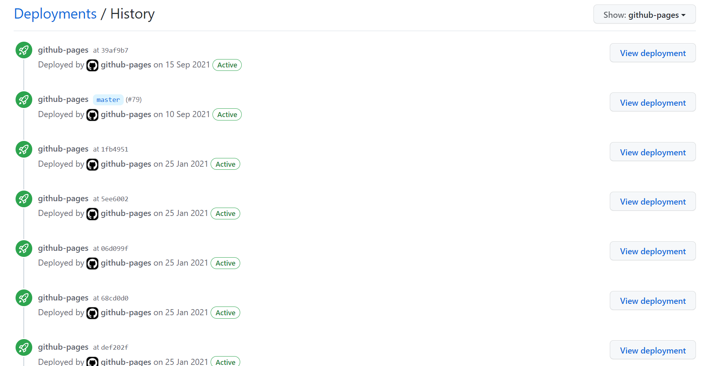
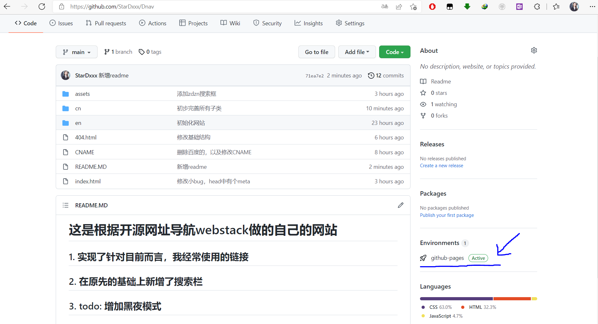
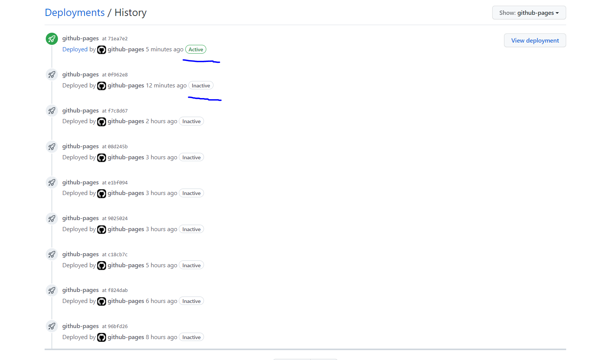
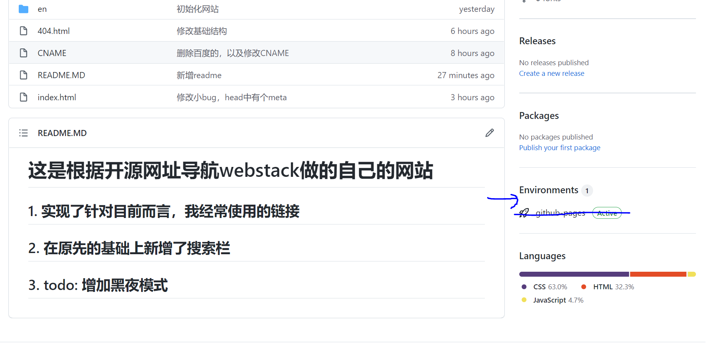

# 这是根据开源网址导航webstack做的自己的网站

## 1. 实现了针对目前而言，我经常使用的链接

## 2. 在原先的基础上新增了搜索栏

## 3. todo: 增加黑夜模式

## ps: 误打误撞解决了一个困扰很久的问题

解决前 

每次当我从vscode push到github仓库的时候都会重新激活一次，比如下面这样 
 

解决后 

 

下面说一下解决过程（我也不是完全清楚，我当时想的是，随便试试，不行就删了重新建一个）： 
1. 建立一个空白的仓库
2. 将本地的代码push上去
3. Setting -> Pages 开启github pages服务
4. 下面有Custom domain连接尝试，等他转完
5. 强制开启HTTPS，需要等一会，我也不知道为什么，总之完成第四步之后，先别急，等一会，或者去域名商看一下，刷新下？记不清了
6. setting -> Environments删除
7. Actions -> All workflows删除
8. 做完之后我去仓库主页看了下，发现Environments确实什么都没有了 
 

9. 这样就没问题了，最后每次当我push的时候，都会把上一个取消，然后重新开启一个